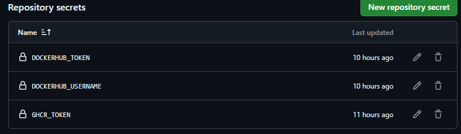
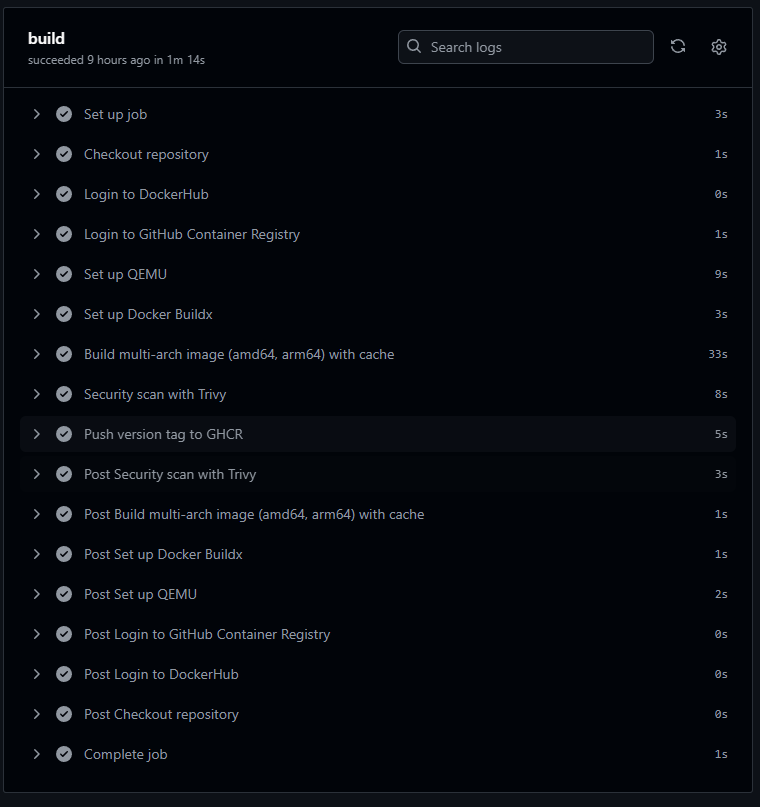
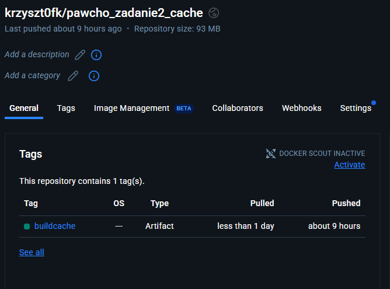
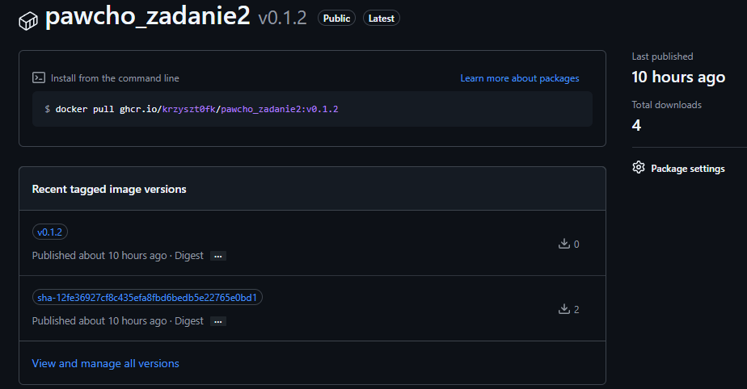

# SPRAWOZDANIE z wykonania zadania 2
### 1. Na podstawie  Dockerfile-a oraz kodów źródłowych aplikacji opracowanej jako rozwiązanie zadania nr 1 stworzony został pipeline w usłudze GitHub Actions, który buduje obraz kontenera.
### Opracowany łańcuch został umieszczony w *.github/workflows/docker-multiarch-ci.yml*
### Spełnia on warunki:
- wsparcie architektur: linux/arm64 oraz linux/amd64. Aby zbudować obraz na wiele architektur instalujemy QEMU oraz narzędzie Buildx:
```shell 
      - name: Set up QEMU
        uses: docker/setup-qemu-action@v3 

      - name: Set up Docker Buildx
        uses: docker/setup-buildx-action@v3
      # Budowanie obrazu z cache
      - name: Build multi-arch image (amd64, arm64) with cache
        uses: docker/build-push-action@v6
        with:
          context: .
          file: ./Dockerfile
          platforms: linux/amd64,linux/arm64
          push: true
          #tagujemy obraz commitem (sha) - unikalny identyfikator builda
          tags: ghcr.io/krzyszt0fk/pawcho_zadanie2:sha-${{ github.sha }}
          # Użycie cache z DockerHub
          cache-from: type=registry,ref=krzyszt0fk/pawcho_zadanie2_cache:buildcache
          cache-to: type=registry,ref=krzyszt0fk/pawcho_zadanie2_cache:buildcache,mode=max
```
Tag typu commit SHA to unikalny identyfikator na podstawie pełnego hash commita. Zapewnia to jednoznaczne powiązanie obrazu z konkretnym stanem repozytorium. Tagi oparte na commitach są niezmienne i umożliwiają śledzenie, jaka wersja kodu odpowiada danemu obrazowi

- Wykorzystuje dane cache przechowywane w publicznym repozytorium DockerHub (https://hub.docker.com/repository/docker/krzyszt0fk/pawcho_zadanie2_cache/general)
- Wykonuje test CVE. Zapewnia to przesłanie obrazu do repozytorium tylko gdy nie będzie zawierał zagrożeń
  sklasyfikowanych jako krytyczne lub wysokie:
```shell
      - name: Security scan with Trivy
        uses: aquasecurity/trivy-action@0.30.0
        with:
          scan-type: image
          image-ref: ghcr.io/krzyszt0fk/pawcho_zadanie2:sha-${{ github.sha }}
          format: table
          severity: CRITICAL,HIGH       
          ignore-unfixed: true          
          exit-code: 1 
```
W efekcie końcowym, jeżeli wszystko przeszło pomyślnie, w GitHub Container Registry pojawi się obraz ghcr.io/krzyszt0fk/pawcho_zadanie2 oznaczony:
- tagiem unikatowym sha-<skrót> – zawsze dla identyfikacji konkretnego buildu
- tagiem wersji, jeśli pipeline był wywołany przez utworzenie takiego tagu w repo

Tag SHA gwarantuje niezmienność i pełną odtwarzalność builda. Semver jest czytelny dla użytkownika, dlatego oba podjeścia zostały złączone.

Jeśli skan znalazł krytyczne podatności, kroki push wersji w ogóle się nie wykonają tym samym żaden obraz nie zostanie opublikowany z nowym tagiem.
```shell
       - name: Push version tag to GHCR
        if: ${{ startsWith(github.ref, 'refs/tags/v') && success() }}
        run: |
          VERSION=${GITHUB_REF#refs/tags/}
          echo "Tagging image with version $VERSION"
          docker pull ghcr.io/krzyszt0fk/pawcho_zadanie2:sha-${GITHUB_SHA}
          docker tag ghcr.io/krzyszt0fk/pawcho_zadanie2:sha-${GITHUB_SHA} ghcr.io/krzyszt0fk/pawcho_zadanie2:${VERSION}
          docker push ghcr.io/krzyszt0fk/pawcho_zadanie2:${VERSION}
```

### 2. Tworzenie tokenów 
Aby powyższy workflow działał został przygotowany:
- GHCR_TOKEN
- DOCKERHUB_TOKEN
- DOCKERHUB_USERNAME
  
Powyższe secrety dodane zostały do repozytorium na GitHub. 

## 3. Uruchomienie
Utworzenie nowego tag-a:
```shell
git tag v0.1.2
```
Przesłanie tag-a na repozytorium Github
```shell
git push origin v0.1.2
```

## 4. Sprawdzenie poprawności działania
W zakładce Actions logi potwierdzają działanie łańcucha:



W repozytorium Dockerhub pojawił się obraz buildcache:


W pakietach Github pojawił się nowy pakiet z odpowiednim tagiem

