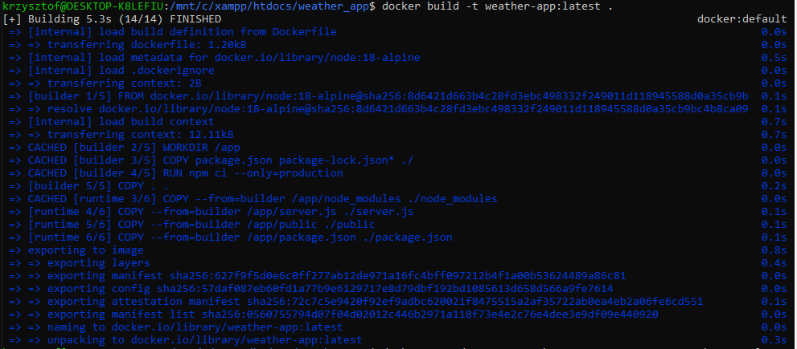
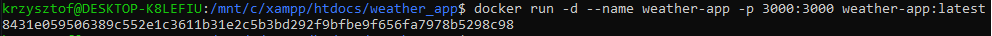
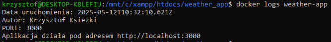
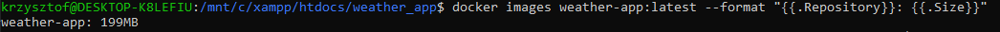
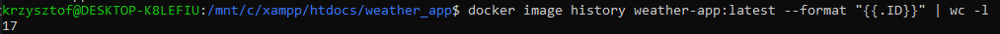
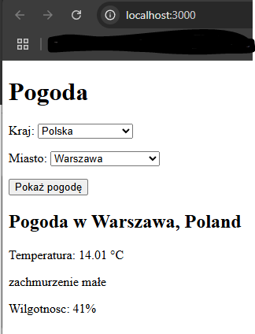

# SPRAWOZDANIE z wykonania zadania 1 - część obowiązkowa
## 1. Polecenie użyte do budowy obrazu
```shell 
docker build -t weather-app:latest .
```
Wynik działania polecenia:


## 2. Polecenie uruchamiające kontener
```shell
docker run -d --name weather-app -p 3000:3000 weather-app:latest
```
Wynik działania polecenia


## 3. Wyświetlenie informacji z logów aplikacji
```shell
docker logs weather-app
```
Wynik działania polecenia


## 4. Wyświetlenie rozmiaru obrazu
```shell
docker images weather-app:latest --format "{{.Repository}}: {{.Size}}"
```
Wynik działania polecenia


## 5. Wyświetlenie ilości warstw
```shell
docker image history weather-app:latest --format "{{.ID}}" | wc -l
```
Wynik działania polecenia


## 6. Działanie aplikacji
Aplikacja działa pod adresem: 
```shell
http://localhost:3000/
```



