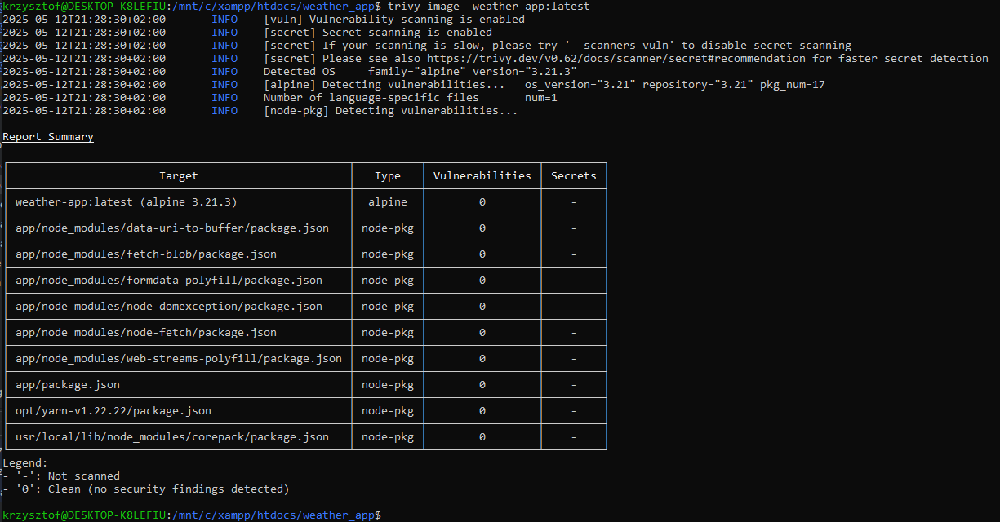

# Sprawozdanie z zadania 1 z części dodatkowej

## 1. Sprawdzenie zagrożeń o poziomie CRITICAL oraz HIGH
Do sprawdzenia zagrożeń zostało wykorzystane narzędzie Trivy. Zostało użyte polecenie: 
```shell 
trivy image  weather-app:latest
```
Wynik działania polecenia:

W sprawdzanym obrazie nie został wykryte podatności na zagrożenia.

## 2. Polecenie do budowania obrazu
```shell
docker buildx build   --builder mybuilder   --file Dockerfile_dod_3   --platform linux/amd64,linux/arm64   --ssh default   --cache-from type=registry,ref=krzyszt0fk/weather-app:cache   --cache-to   type=registry,ref=krzyszt0fk/weather-app:cache,mode=max   --tag        krzyszt0fk/weather-app:latest   --push   .
```

Wynik działania polecenia
```shell
[+] Building 84.4s (25/25) FINISHED                                                                                                  docker-container:mybuilderr
 => [internal] load build definition from Dockerfile_dod_3                                                                                                 0.0sg
 => => transferring dockerfile: 1.03kB                                                                                                                     0.0s
 => resolve image config for docker-image://docker.io/docker/dockerfile:1.4                                                                                1.1s
 => [auth] docker/dockerfile:pull token for registry-1.docker.io                                                                                           0.0s
 => CACHED docker-image://docker.io/docker/dockerfile:1.4@sha256:9ba7531bd80fb0a858632727cf7a112fbfd19b17e94c4e84ced81e24ef1a0dbc                          0.0s
 => => resolve docker.io/docker/dockerfile:1.4@sha256:9ba7531bd80fb0a858632727cf7a112fbfd19b17e94c4e84ced81e24ef1a0dbc                                     0.0s
 => [internal] load .dockerignore                                                                                                                          0.0s
 => => transferring context: 2B                                                                                                                            0.0s
 => [linux/arm64 internal] load metadata for docker.io/library/node:18-alpine                                                                              0.2s
 => [linux/amd64 internal] load metadata for docker.io/library/node:18-alpine                                                                              0.4s
 => ERROR importing cache manifest from krzyszt0fk/weather-app:cache                                                                                       0.4s
 => CACHED [linux/amd64 builder 1/4] FROM docker.io/library/node:18-alpine@sha256:8d6421d663b4c28fd3ebc498332f249011d118945588d0a35cb9bc4b8ca09d9e         0.1s
 => => resolve docker.io/library/node:18-alpine@sha256:8d6421d663b4c28fd3ebc498332f249011d118945588d0a35cb9bc4b8ca09d9e                                    0.1s
 => CACHED [linux/arm64 builder 1/4] FROM docker.io/library/node:18-alpine@sha256:8d6421d663b4c28fd3ebc498332f249011d118945588d0a35cb9bc4b8ca09d9e         0.1s
 => => resolve docker.io/library/node:18-alpine@sha256:8d6421d663b4c28fd3ebc498332f249011d118945588d0a35cb9bc4b8ca09d9e                                    0.0s
 => [linux/amd64 builder 2/4] RUN apk add --no-cache git openssh-client ca-certificates                                                                    2.5s
 => [linux/amd64 runtime 2/4] RUN rm -rf /usr/local/lib/node_modules/npm                                                                                   1.7s
 => [linux/arm64 builder 2/4] RUN apk add --no-cache git openssh-client ca-certificates                                                                    5.4s
 => [linux/arm64 runtime 2/4] RUN rm -rf /usr/local/lib/node_modules/npm                                                                                   2.0s
 => [linux/amd64 runtime 3/4] WORKDIR /app                                                                                                                 0.1s
 => [linux/arm64 runtime 3/4] WORKDIR /app                                                                                                                 0.1s
 => [linux/amd64 builder 3/4] WORKDIR /app                                                                                                                 0.1s
 => [linux/amd64 builder 4/4] RUN --mount=type=ssh     --mount=type=cache,id=npm,target=/root/.npm     mkdir -p /root/.ssh &&     ssh-keyscan github.com   4.9s
 => [linux/arm64 builder 3/4] WORKDIR /app                                                                                                                 0.1s
 => [linux/arm64 builder 4/4] RUN --mount=type=ssh     --mount=type=cache,id=npm,target=/root/.npm     mkdir -p /root/.ssh &&     ssh-keyscan github.com  16.5s
 => [linux/amd64 runtime 4/4] COPY --from=builder /app .                                                                                                   0.1s
 => [linux/arm64 runtime 4/4] COPY --from=builder /app .                                                                                                   0.1s
 => exporting to image                                                                                                                                    31.5s
 => => exporting layers                                                                                                                                    1.0s
 => => exporting manifest sha256:4d7b66ff2d2425c41002f7ebb5ff8dd69b1a13a894ea86897132d8d2fe6a09e9                                                          0.0s
 => => exporting config sha256:ae91961295f63c84417e13645eb0c910e3bf3ce5f7cce255ecdf49077e96eab1                                                            0.0s
 => => exporting attestation manifest sha256:a244f9d66447b4265125c76b9848c51b0d09cbbb1cc90868487cbcba7a9c4402                                              0.1s
 => => exporting manifest sha256:01413943b8db9b3dd8b02edb0f9283728f6cc9b1c402b5dc80c722c156bd31d7                                                          0.0s
 => => exporting config sha256:30b68e3ca9dbb7c308a5c5092cfad723ee266c28626567581d5b0865db813403                                                            0.0s
 => => exporting attestation manifest sha256:2633bc0270d7d1c3b904a070a7ff52413b590630dae18f3abfbbcd45e922f800                                              0.1s
 => => exporting manifest list sha256:12f07bd66661ed9c77f1592c0b9de52cb87254481450955d14d1befd1e5a28ac                                                     0.0s
 => => pushing layers                                                                                                                                     26.5s
 => => pushing manifest for docker.io/krzyszt0fk/weather-app:latest@sha256:12f07bd66661ed9c77f1592c0b9de52cb87254481450955d14d1befd1e5a28ac                3.6s
 => [auth] krzyszt0fk/weather-app:pull,push token for registry-1.docker.io                                                                                 0.0s
 => exporting cache to registry                                                                                                                           28.1s
 => => preparing build cache for export                                                                                                                   28.1s
 => => writing layer sha256:02bb84e9f3412827f177bc6c020812249b32a8425d2c1858e9d71bd4c015f031                                                              10.3s
 => => writing layer sha256:034107a618084a925b29bdc5ac3107123cfb613b9ac1d9cd3d647670e0c303fb                                                               2.3s
 => => writing layer sha256:1e5a4c89cee5c0826c540ab06d4b6b491c96eda01837f430bd47f0d26702d6e3                                                               0.2s
 => => writing layer sha256:25ff2da83641908f65c3a74d80409d6b1b62ccfaab220b9ea70b80df5a2e0549                                                               0.2s
 => => writing layer sha256:2ae146610d8bb2a3346cf673062eb600281300380e3e877f33ff83993e41787c                                                               0.7s
 => => writing layer sha256:37e8450126274f81ae79598dd71aa5d115cacc660b842e0a8c0fec0486733310                                                               0.7s
 => => writing layer sha256:3c87516cd076ede8b34620ff0f9d24d4ccd2e3ee3de06b07ffd8ef8b82a3118a                                                               0.4s
 => => writing layer sha256:4b1617a2788f1fb10dc8f658727759d305f49d98bb2b00c2df730c2729c9d38f                                                               0.0s
 => => writing layer sha256:6e771e15690e2fabf2332d3a3b744495411d6e0b00b2aea64419b58b0066cf81                                                               0.2s
 => => writing layer sha256:80d5eaa76ed3cf56777bb14d6e13ea37d3e4df8cf52224111cb26af29d354c8c                                                               1.3s
 => => writing layer sha256:8bfa36aa66ce614f6da68a16fb71f875da8d623310f0cb80ae1ecfa092f587f6                                                               0.2s
 => => writing layer sha256:9d01236d7deed6130d917cd33ca61f2a9e3c9e102aa7b314ae4acceeed1e2c42                                                               3.2s
 => => writing layer sha256:d07939570ca5853a4b9bbcbd56d8d5d3fce5ec0bec16964336a0f07d5033094d                                                               1.0s
 => => writing layer sha256:d7e8282e1dd00b06664901c8428beef1a13f94815430bf7c9aa834bcaa909a5d                                                               0.6s
 => => writing layer sha256:d84c815451acbca96b6e6bdb479929222bec57121dfe10cc5b128c5c2dbaf10a                                                               0.2s
 => => writing layer sha256:dd71dde834b5c203d162902e6b8994cb2309ae049a0eabc4efea161b2b5a3d0e                                                               0.2s
 => => writing layer sha256:f18232174bc91741fdf3da96d85011092101a032a93a388b79e99e69c2d5c870                                                               0.2s
 => => writing layer sha256:fdb049f527ae201156f2f5b43e08610eaf36ec168d9c0a286577f084400b6f7f                                                               2.2s
 => => writing config sha256:2f8c41a68d092b98aee80a8089f37c3babeb78a0b4f653abefd3168a29ec03e0                                                              0.9s
 => => writing cache image manifest sha256:d338a4bba7123111a1dfaec3a8768b681827adb7643ae779c8d1e4b5c9b0874b                                                0.9s
------
 > importing cache manifest from krzyszt0fk/weather-app:cache:
------
```
Po wykonaniu zostały wygenerowane i wypchnięte do DockerHub obrazy dla obu architektur (amd64 i arm64) w oparciu o BuildKit i builder mybuilder. W trakcie budowy wykorzystano SSH‐mount klonowania repozytorium, a także załadowano i zapisano cache warstw w rejestrze.

## 3. Analiza manifestu
Wykorzystane zostało polecenie: 
```shell
docker buildx imagetools inspect krzyszt0fk/weather-app:latest
```
Wynik:
```shell
Name:      docker.io/krzyszt0fk/weather-app:latest
MediaType: application/vnd.oci.image.index.v1+json
Digest:    sha256:12f07bd66661ed9c77f1592c0b9de52cb87254481450955d14d1befd1e5a28ac

Manifests:
  Name:        docker.io/krzyszt0fk/weather-app:latest@sha256:4d7b66ff2d2425c41002f7ebb5ff8dd69b1a13a894ea86897132d8d2fe6a09e9
  MediaType:   application/vnd.oci.image.manifest.v1+json
  Platform:    linux/amd64

  Name:        docker.io/krzyszt0fk/weather-app:latest@sha256:01413943b8db9b3dd8b02edb0f9283728f6cc9b1c402b5dc80c722c156bd31d7
  MediaType:   application/vnd.oci.image.manifest.v1+json
  Platform:    linux/arm64

  Name:        docker.io/krzyszt0fk/weather-app:latest@sha256:a244f9d66447b4265125c76b9848c51b0d09cbbb1cc90868487cbcba7a9c4402
  MediaType:   application/vnd.oci.image.manifest.v1+json
  Platform:    unknown/unknown
  Annotations:
    vnd.docker.reference.digest: sha256:4d7b66ff2d2425c41002f7ebb5ff8dd69b1a13a894ea86897132d8d2fe6a09e9
    vnd.docker.reference.type:   attestation-manifest

  Name:        docker.io/krzyszt0fk/weather-app:latest@sha256:2633bc0270d7d1c3b904a070a7ff52413b590630dae18f3abfbbcd45e922f800
  MediaType:   application/vnd.oci.image.manifest.v1+json
  Platform:    unknown/unknown
  Annotations:
    vnd.docker.reference.digest: sha256:01413943b8db9b3dd8b02edb0f9283728f6cc9b1c402b5dc80c722c156bd31d7
    vnd.docker.reference.type:   attestation-manifest
```
Powyższy manifest zawiera deklaracje dla platform: linux/arm64 oraz linux/amd64

## 4. Link do repozytorium DockerHub
```shell
https://hub.docker.com/r/krzyszt0fk/weather-app/tags
```

